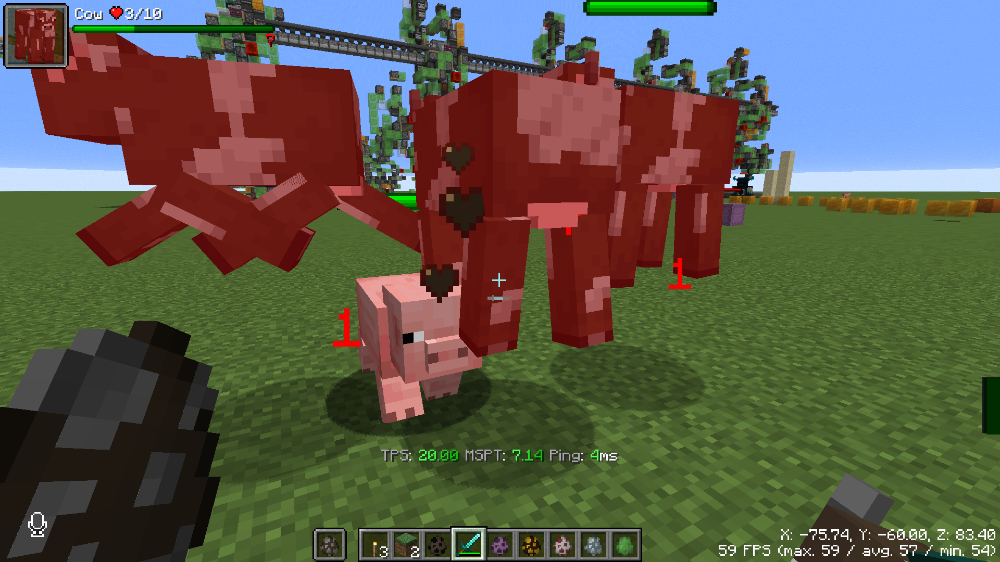

# ToroHealth Damage Indicators Continued
ToroHealth-Continued is a maintained fork of [ToroHealth Damage Indicators](https://github.com/ToroCraft/ToroHealth), providing in-world health bars and damage indicators for entities, updated for modern Minecraft versions. This project improved visual quality, configurability, performance etc. while keeping the functionality of the original project.

### Functionalities
* HUD

show the basic information of the entity you are looking at.

* Health Change Particles

Damage dealt, healed is shown as floating particles

* In-World Health Bar

Health Bar can be rendered on entities' head in world.

### [Download from here](https://placeholder.com)

